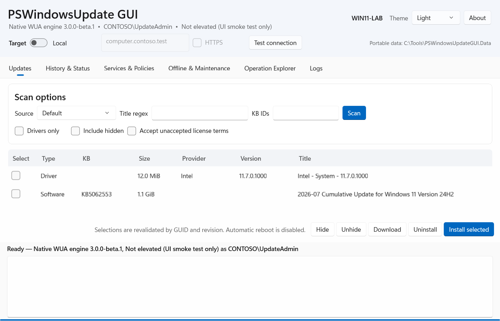

# PSWindowsUpdate GUI

PSWindowsUpdate GUI 2 is a portable Windows 11 x64 graphical and command-line
administrator tool built directly on Windows Update Agent (WUA). The release is one
executable and uses the update engine and .NET Framework already included with Windows.

> [!WARNING]
> This is an administrator tool. Installing or uninstalling updates, changing
> policy, resetting components, and scheduling jobs can interrupt users or make
> a machine temporarily unavailable. Scan first, use `--plan`, and keep tested
> backups or VM snapshots.



_Screenshot uses the repository's non-mutating UI smoke adapter and synthetic host identity._

## Highlights

- One elevated .NET Framework 4.8 executable; Windows 11 already includes its runtime.
- Direct typed WUA engine with GUID-and-revision update selection.
- Software and driver scan, download, install, uninstall, hide, and unhide workflows.
- Asynchronous WUA progress, timeout, abort requests, structured HRESULTs, and reboot state.
- Online Windows Update, Microsoft Update, managed WSUS, registered service, and
  Microsoft-signed `wsusscn2.cab` offline scan sources.
- Same-EXE CLI with versioned JSON, stable exit codes, `--plan`, and noninteractive confirmation gates.
- Secure one-target WinRM execution by temporarily staging the exact hashed EXE.
- Allowlisted policy editing with automatic backups, recoverable component reset,
  fixed scheduled-job manifests, and Credential Manager-backed SMTP reporting.
- No arbitrary PowerShell or script execution.

## Requirements and quick start

- Windows 11 x64, build 22000 or newer.
- Administrator elevation.
- For remote targets, preconfigured Kerberos WinRM or certificate-validated WinRM HTTPS.

Download `PSWindowsUpdateGUI.exe` and its checksum, verify it, then run it:

```powershell
(Get-FileHash .\PSWindowsUpdateGUI.exe -Algorithm SHA256).Hash
.\PSWindowsUpdateGUI.exe
```

Use an already elevated PowerShell window for CLI mode so UAC does not detach the
new process from the calling console:

```powershell
.\PSWindowsUpdateGUI.exe scan --type driver --output json
.\PSWindowsUpdateGUI.exe install --update '<guid>:<revision>' --accept-eula --plan
.\PSWindowsUpdateGUI.exe status --computer workstation.contoso.test --use-ssl --output json
```

Launching without arguments opens WPF. See [CLI reference](docs/CLI.md),
[remote administration](docs/REMOTE.md), and [security model](docs/SECURITY.md).

The implementation follows Microsoft's [WUA object model](https://learn.microsoft.com/windows/win32/wua_sdk/windows-update-agent-object-model),
[asynchronous operation guidance](https://learn.microsoft.com/windows/win32/wua_sdk/guidelines-for-asynchronous-wua-operations),
[offline scan limitations](https://learn.microsoft.com/windows/win32/wua_sdk/using-wua-to-scan-for-updates-offline),
and [remote interface restrictions](https://learn.microsoft.com/windows/win32/wua_sdk/using-wua-from-a-remote-computer).

## Safety defaults

- Scan only until an explicit action is selected.
- Never select updates by title or KB alone; mutations require WUA UpdateID and revision.
- No automatic reboot.
- Unaccepted EULAs require explicit `--accept-eula` or GUI confirmation.
- GUI mutations show a summary. CLI mutations prompt for `YES`; redirected input requires `--yes`.
- Offline CABs only assess security-update applicability and do not contain payloads.
- WUA-driven operations may not appear in the Windows Settings orchestrator UI.

## Build

```powershell
$env:DOTNET_EXE = (Resolve-Path .\.tools\dotnet\dotnet.exe)
powershell.exe -NoProfile -ExecutionPolicy Bypass -File .\build\Build.ps1 -Version 2.0.0-beta.1
```

The build verifies Microsoft Authenticode on the system WUA DLL, generates an
interop reference from its installed type library, embeds only referenced COM types,
runs tests, and emits the EXE, checksum, SPDX SBOM, and notices under
`artifacts\release`. No interop DLL or third-party update engine is released.

## Project status

Version `2.0.0-beta.1` is the current major prerelease. Promotion to a stable release
remains gated on local and remote snapshot-backed Windows 11 VM acceptance. The
physical-machine acceptance runner is read-only unless both an exact driver identity
and `--confirm-machine-mutation` are supplied.

The application source is MIT licensed. Release contents and their licenses are
recorded in the generated SPDX SBOM and `THIRD-PARTY-NOTICES.txt`.
